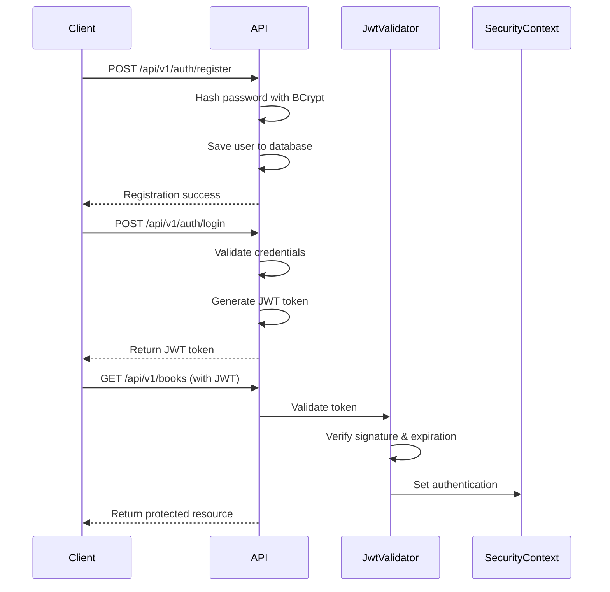

## Introduction

The Library Management API uses a robust JWT (JSON Web Token) based authentication system to secure endpoints and manage user sessions. The authentication mechanism is stateless, meaning no session data is stored on the server.

## Authentication Architecture

The authentication system is built on the following components:

<Steps>
  <Step title="User Registration">
    New users register by providing their credentials, which are securely hashed using BCrypt before storage.
  </Step>
  
  <Step title="User Login">
    Users authenticate with their username and password. Upon successful authentication, a JWT token is generated.
  </Step>
  
  <Step title="Token Validation">
    Each protected endpoint request must include the JWT token in the Authorization header. The token is validated before processing the request.
  </Step>
  
  <Step title="Security Context">
    Valid tokens establish a security context for the request, allowing access to protected resources.
  </Step>
</Steps>

## Key Features

### Stateless Authentication
The API uses stateless authentication, meaning:
- No server-side session storage
- JWT tokens contain all necessary authentication information
- Tokens are self-contained and verifiable
- Session management is handled client-side

### BCrypt Password Hashing
Passwords are never stored in plain text:
- BCrypt algorithm provides secure one-way hashing
- Each password is salted automatically
- Brute-force attacks are computationally expensive

### JWT Token Security
Tokens are signed and validated:
- HMAC256 algorithm ensures token integrity
- Tokens include expiration time to limit validity
- Issuer verification prevents token forgery
- Unique JWT ID (jti) for each token

## Security Configuration

The API implements several security measures:

<CodeGroup>
```java SecurityConfig.java
@Configuration
@EnableWebSecurity
public class SecurityConfig {
    
    @Bean
    public SecurityFilterChain filterChain(HttpSecurity httpSecurity) throws Exception {
        httpSecurity
            .csrf(csrf -> csrf.disable())
            .sessionManagement(session -> 
                session.sessionCreationPolicy(SessionCreationPolicy.STATELESS))
            .authorizeHttpRequests(http -> {
                // Public endpoints
                http.requestMatchers(HttpMethod.POST, "/api/v1/auth/**").permitAll();
                
                // Protected endpoints
                http.anyRequest().authenticated();
            })
            .addFilterBefore(new JwtTokenValidator(jwtUtils), 
                BasicAuthenticationFilter.class);
        
        return httpSecurity.build();
    }
    
    @Bean
    public PasswordEncoder passwordEncoder() {
        return new BCryptPasswordEncoder();
    }
}
```
</CodeGroup>

<Info>
  The security configuration disables CSRF protection since the API is stateless and uses JWT tokens for authentication.
</Info>

## Public vs Protected Endpoints

### Public Endpoints (No Authentication Required)
- `POST /api/v1/auth/register` - User registration
- `POST /api/v1/auth/login` - User login
- Swagger UI documentation endpoints

### Protected Endpoints (JWT Token Required)
- All `/api/v1/users/**` endpoints
- All `/api/v1/books/**` endpoints
- Any endpoint not explicitly marked as public

<Warning>
  Attempting to access protected endpoints without a valid JWT token will result in a 401 Unauthorized response.
</Warning>

## Authentication Flow Diagram



## Token Lifecycle

1. **Token Generation**: Created upon successful login with user credentials
2. **Token Usage**: Included in Authorization header for subsequent requests
3. **Token Validation**: Verified on each request to protected endpoints
4. **Token Expiration**: Automatically expires after 30 minutes (1800000 ms)
5. **Token Refresh**: Client must re-authenticate to obtain a new token

<Info>
  Tokens expire 30 minutes after issuance. Plan your client-side token refresh strategy accordingly.
</Info>

## Next Steps

<CardGroup cols={2}>
  <Card title="JWT Tokens" icon="key" href="/authentication/jwt-tokens">
    Learn about JWT token structure, claims, and validation
  </Card>
  
  <Card title="User Registration" icon="user-plus" href="/authentication/registration">
    Understand the registration process and requirements
  </Card>
  
  <Card title="User Login" icon="right-to-bracket" href="/authentication/login">
    Explore the login flow and token generation
  </Card>
  
  <Card title="API Endpoints" icon="code" href="/api/auth/register">
    View detailed API endpoint documentation
  </Card>
</CardGroup>
