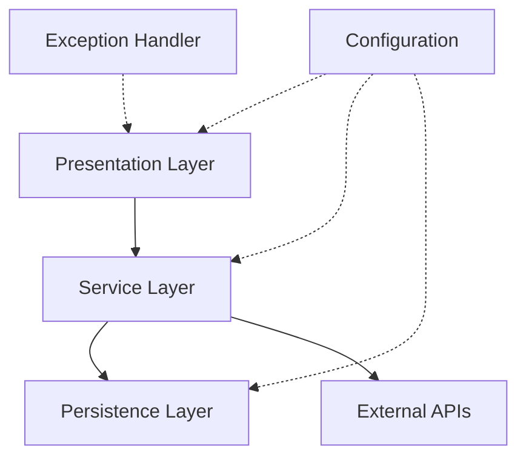

## Architecture Overview

The Library Management API follows a **layered architecture** pattern with clear separation of concerns. Each layer has a specific responsibility and communicates with adjacent layers through well-defined interfaces.



<CardGroup cols={3}>
  <Card title="Presentation" icon="browser">
    Controllers and DTOs
  </Card>
  <Card title="Service" icon="gears">
    Business logic
  </Card>
  <Card title="Persistence" icon="database">
    Data access layer
  </Card>
</CardGroup>

## Directory Structure

```
jc-java-training/
├── src/
│   ├── main/
│   │   ├── java/com/raven/training/
│   │   │   ├── TrainingApplication.java     # Main application class
│   │   │   ├── config/                      # Configuration classes
│   │   │   │   ├── AppConfig.java
│   │   │   │   ├── filter/
│   │   │   │   │   └── JwtTokenValidator.java
│   │   │   │   └── security/
│   │   │   │       ├── SecurityConfig.java
│   │   │   │       └── SwaggerConfig.java
│   │   │   ├── exception/                   # Exception handling
│   │   │   │   ├── error/
│   │   │   │   │   ├── BookNotFoundException.java
│   │   │   │   │   ├── BookAlreadyInCollectionException.java
│   │   │   │   │   ├── BookNotInCollectionException.java
│   │   │   │   │   ├── UserNotFoundException.java
│   │   │   │   │   ├── EmailAlreadyExistsException.java
│   │   │   │   │   └── UsernameAlreadyExistsException.java
│   │   │   │   └── handler/
│   │   │   │       └── GlobalExceptionHandler.java
│   │   │   ├── mapper/                      # Object mappers
│   │   │   │   ├── IBookMapper.java
│   │   │   │   └── IUserMapper.java
│   │   │   ├── persistence/                 # Data layer
│   │   │   │   ├── entity/
│   │   │   │   │   ├── Book.java
│   │   │   │   │   ├── User.java
│   │   │   │   │   └── AuthUser.java
│   │   │   │   ├── model/
│   │   │   │   │   ├── ApiError.java
│   │   │   │   │   └── ErrorResponse.java
│   │   │   │   └── repository/
│   │   │   │       ├── IBookRepository.java
│   │   │   │       ├── IUserRepository.java
│   │   │   │       └── IAuthUserRepository.java
│   │   │   ├── presentation/                 # API layer
│   │   │   │   ├── controller/
│   │   │   │   │   ├── BookController.java
│   │   │   │   │   ├── UserController.java
│   │   │   │   │   └── AuthUserController.java
│   │   │   │   └── dto/
│   │   │   │       ├── book/
│   │   │   │       │   ├── BookRequest.java
│   │   │   │       │   ├── BookResponse.java
│   │   │   │       │   └── bookexternal/
│   │   │   │       │       ├── BookResponseDTO.java
│   │   │   │       │       └── OpenLibraryBookDTO.java
│   │   │   │       ├── user/
│   │   │   │       │   ├── UserRequest.java
│   │   │   │       │   └── UserResponse.java
│   │   │   │       ├── login/
│   │   │   │       │   └── LoginRequest.java
│   │   │   │       ├── register/
│   │   │   │       │   └── RegisterRequest.java
│   │   │   │       └── pagination/
│   │   │   │           └── CustomPageableResponse.java
│   │   │   ├── service/                     # Business logic
│   │   │   │   ├── interfaces/
│   │   │   │   │   ├── IBookService.java
│   │   │   │   │   └── IUserService.java
│   │   │   │   └── implementation/
│   │   │   │       ├── BookServiceImpl.java
│   │   │   │       ├── UserServiceImpl.java
│   │   │   │       ├── UserDetailServiceImpl.java
│   │   │   │       └── OpenLibraryService.java
│   │   │   └── util/                        # Utility classes
│   │   │       ├── JwtUtils.java
│   │   │       └── deserializer/
│   │   │           └── IdentifierDeserializer.java
│   │   └── resources/
│   │       ├── application.properties
│   │       └── static/
│   └── test/
│       └── java/com/raven/training/         # Test classes (mirrors main structure)
├── pom.xml                                  # Maven configuration
├── mvnw                                     # Maven wrapper (Unix)
├── mvnw.cmd                                 # Maven wrapper (Windows)
└── README.md
```

## Package Structure

### Root Package: `com.raven.training`

#### Main Application Class

```java
@SpringBootApplication
public class TrainingApplication {
    public static void main(String[] args) {
        SpringApplication.run(TrainingApplication.class, args);
    }
}
```

<Note>
  The `@SpringBootApplication` annotation combines `@Configuration`, `@EnableAutoConfiguration`, and `@ComponentScan`.
</Note>

---

### 1. Config Package (`config/`)

**Purpose**: Application configuration, security, and filters

#### Key Components:

<AccordionGroup>
  <Accordion title="SecurityConfig.java">
    Configures Spring Security with JWT authentication:
    - Implements stateless authentication
    - Defines public endpoints (Swagger, auth)
    - Protects API endpoints with JWT
    - Configures BCrypt password encoding
    - Sets up CORS and CSRF policies
  </Accordion>
  
  <Accordion title="JwtTokenValidator.java (filter/)">
    Custom filter for validating JWT tokens:
    - Extracts JWT from Authorization header
    - Validates token signature and expiration
    - Sets authentication in SecurityContext
    - Runs on every request to protected endpoints
  </Accordion>
  
  <Accordion title="SwaggerConfig.java (security/)">
    Configures OpenAPI/Swagger documentation:
    - Defines API information and metadata
    - Configures JWT security scheme for Swagger UI
    - Enables interactive API testing
  </Accordion>
  
  <Accordion title="AppConfig.java">
    General application configuration:
    - Bean definitions (RestTemplate, ObjectMapper, etc.)
    - Custom serializers/deserializers
    - Application-wide settings
  </Accordion>
</AccordionGroup>

**Usage Example**:
```java
@Configuration
@EnableWebSecurity
public class SecurityConfig {
    @Bean
    public SecurityFilterChain securityFilterChain(HttpSecurity http) {
        // Security configuration
    }
}
```

---

### 2. Exception Package (`exception/`)

**Purpose**: Centralized exception handling and custom error types

#### Structure:

**`error/`** - Custom exception classes:
- `BookNotFoundException` - Thrown when a book is not found
- `BookAlreadyInCollectionException` - Book already in user's collection
- `BookNotInCollectionException` - Book not in user's collection
- `UserNotFoundException` - User not found
- `EmailAlreadyExistsException` - Email already registered
- `UsernameAlreadyExistsException` - Username already taken

**`handler/`** - Exception handlers:
- `GlobalExceptionHandler` - Centralized exception handling using `@ControllerAdvice`

**Example Custom Exception**:
```java
public class BookNotFoundException extends RuntimeException {
    public BookNotFoundException(UUID id) {
        super("Book not found with id: " + id);
    }
}
```

**Global Exception Handler**:
```java
@RestControllerAdvice
public class GlobalExceptionHandler {
    
    @ExceptionHandler(BookNotFoundException.class)
    public ResponseEntity<ErrorResponse> handleBookNotFound(BookNotFoundException ex) {
        ErrorResponse error = new ErrorResponse(
            HttpStatus.NOT_FOUND.value(),
            ex.getMessage(),
            LocalDateTime.now()
        );
        return new ResponseEntity<>(error, HttpStatus.NOT_FOUND);
    }
}
```

---

### 3. Mapper Package (`mapper/`)

**Purpose**: Object mapping between layers using MapStruct

**Key Mappers**:

<Tabs>
  <Tab title="IBookMapper">
    ```java
    @Mapper(componentModel = "spring",
            nullValuePropertyMappingStrategy = NullValuePropertyMappingStrategy.IGNORE)
    public interface IBookMapper {
        
        @Mapping(target = "id", ignore = true)
        @Mapping(target = "users", ignore = true)
        Book toEntity(BookRequest bookRequest);
        
        BookResponse toResponse(Book book);
        
        List<BookResponse> toResponseList(List<Book> bookList);
    }
    ```
  </Tab>
  <Tab title="IUserMapper">
    ```java
    @Mapper(componentModel = "spring",
            nullValuePropertyMappingStrategy = NullValuePropertyMappingStrategy.IGNORE)
    public interface IUserMapper {
        
        @Mapping(target = "id", ignore = true)
        @Mapping(target = "books", ignore = true)
        User toEntity(UserRequest userRequest);
        
        UserResponse toResponse(User user);
        
        List<UserResponse> toResponseList(List<User> userList);
    }
    ```
  </Tab>
</Tabs>

<Info>
  MapStruct generates implementation classes at compile time. The generated classes are in `target/generated-sources/annotations/`.
</Info>

**Why MapStruct?**
- Type-safe object mapping
- Compile-time code generation (no reflection overhead)
- Integration with Lombok
- Automatic null handling
- Custom mapping rules support

---

### 4. Persistence Package (`persistence/`)

**Purpose**: Data access layer, entities, and repositories

#### Subpackages:

<CardGroup cols={3}>
  <Card title="entity/" icon="table">
    JPA entities mapped to database tables
  </Card>
  <Card title="model/" icon="cube">
    Domain models and value objects
  </Card>
  <Card title="repository/" icon="database">
    Spring Data JPA repositories
  </Card>
</CardGroup>

#### Entities

**Book Entity**:
```java
@Entity
@Table(name = "books")
@Data
@Builder
@NoArgsConstructor
@AllArgsConstructor
public class Book {
    @Id
    @GeneratedValue(strategy = GenerationType.UUID)
    private UUID id;
    
    private String title;
    private String author;
    private String gender;  // Genre
    private String image;
    private String subtitle;
    private String publisher;
    private String year;
    private Integer pages;
    
    @Column(unique = true)
    private String isbn;
    
    @ManyToMany(mappedBy = "books")
    private Set<User> users = new HashSet<>();
}
```

**User Entity**:
```java
@Entity
@Table(name = "users")
@Data
@Builder
@NoArgsConstructor
@AllArgsConstructor
public class User {
    @Id
    @GeneratedValue(strategy = GenerationType.UUID)
    private UUID id;
    
    private String name;
    private String email;
    
    @ManyToMany
    @JoinTable(
        name = "user_books",
        joinColumns = @JoinColumn(name = "user_id"),
        inverseJoinColumns = @JoinColumn(name = "book_id")
    )
    private Set<Book> books = new HashSet<>();
}
```

#### Repositories

**IBookRepository**:
```java
@Repository
public interface IBookRepository extends JpaRepository<Book, UUID> {
    
    @Query("SELECT b FROM Book b WHERE " +
           "(:title IS NULL OR :title = '' OR LOWER(b.title) LIKE LOWER(CONCAT('%', :title, '%'))) AND " +
           "(:author IS NULL OR :author = '' OR LOWER(b.author) LIKE LOWER(CONCAT('%', :author, '%'))) AND " +
           "(:gender IS NULL OR :gender = '' OR LOWER(b.gender) LIKE LOWER(CONCAT('%', :gender, '%')))")
    Page<Book> findAllWithFilters(
        @Param("title") String title,
        @Param("author") String author,
        @Param("gender") String gender,
        Pageable pageable
    );
    
    boolean existsByIsbn(String isbn);
}
```

<Note>
  Spring Data JPA provides automatic implementation of repository interfaces.
</Note>

---

### 5. Presentation Package (`presentation/`)

**Purpose**: REST API controllers and data transfer objects

#### Subpackages:

**`controller/`** - REST endpoints:
- `BookController` - Book management endpoints
- `UserController` - User management endpoints
- `AuthUserController` - Authentication endpoints (login, register)

**`dto/`** - Data Transfer Objects organized by domain:
- `book/` - Book DTOs
- `user/` - User DTOs
- `login/` - Login DTOs
- `register/` - Registration DTOs
- `pagination/` - Pagination response wrapper

#### Controller Example

```java
@RestController
@RequestMapping("/api/v1/books")
@AllArgsConstructor
public class BookController {

    private final IBookService bookService;
    private final OpenLibraryService openLibraryService;
    private final IBookRepository bookRepository;

    /**
     * Retrieves a paginated list of books with optional filtering.
     */
    @GetMapping("/findAll")
    public ResponseEntity<CustomPageableResponse<BookResponse>> findAll(
            @RequestParam(defaultValue = "0") int page,
            @RequestParam(defaultValue = "10") int size,
            @RequestParam(required = false) String title,
            @RequestParam(required = false) String author,
            @RequestParam(required = false) String gender) {
        
        Pageable pageable = PageRequest.of(page, size, Sort.by("id").ascending());
        Page<BookResponse> booksPage = bookService.findAll(title, author, gender, pageable);
        
        CustomPageableResponse<BookResponse> response = new CustomPageableResponse<>(
            booksPage.getContent(),
            booksPage.getNumberOfElements(),
            booksPage.getSize(),
            booksPage.getNumber() * booksPage.getSize(),
            booksPage.getTotalPages(),
            booksPage.getTotalElements(),
            booksPage.hasPrevious() ? booksPage.getNumber() : null,
            booksPage.getNumber() + 1,
            booksPage.hasNext() ? booksPage.getNumber() + 2 : null
        );
        
        return new ResponseEntity<>(response, HttpStatus.OK);
    }

    @GetMapping("/findById/{id}")
    public ResponseEntity<BookResponse> findById(@PathVariable UUID id) {
        return new ResponseEntity<>(bookService.findById(id), HttpStatus.OK);
    }

    @PostMapping("/create")
    public ResponseEntity<BookResponse> create(@RequestBody BookRequest bookRequest) {
        return new ResponseEntity<>(bookService.save(bookRequest), HttpStatus.CREATED);
    }

    @PutMapping("/update/{id}")
    public ResponseEntity<BookResponse> update(
            @PathVariable UUID id, 
            @RequestBody BookRequest bookRequest) {
        return new ResponseEntity<>(bookService.update(id, bookRequest), HttpStatus.OK);
    }

    @DeleteMapping("/delete/{id}")
    public void delete(@PathVariable UUID id) {
        bookService.delete(id);
    }
}
```

#### DTO Structure

**Request DTO (Record)**:
```java
public record BookRequest(
    String gender,
    String author,
    String image,
    String title,
    String subtitle,
    String publisher,
    String year,
    Integer pages,
    String isbn
) {}
```

**Response DTO (Record)**:
```java
public record BookResponse(
    UUID id,
    String gender,
    String author,
    String image,
    String title,
    String subtitle,
    String publisher,
    String year,
    Integer pages,
    String isbn
) {}
```

<Info>
  The project uses **Java Records** for immutable DTOs, providing concise syntax and built-in equals/hashCode/toString.
</Info>

---

### 6. Service Package (`service/`)

**Purpose**: Business logic layer

#### Structure:

**`interfaces/`** - Service contracts:
- `IBookService` - Book business operations
- `IUserService` - User business operations

**`implementation/`** - Service implementations:
- `BookServiceImpl` - Book business logic
- `UserServiceImpl` - User business logic
- `UserDetailServiceImpl` - Spring Security user details
- `OpenLibraryService` - External API integration

#### Service Pattern

```java
public interface IBookService {
    Page<BookResponse> findAll(String title, String author, String gender, Pageable pageable);
    BookResponse findById(UUID id);
    BookResponse save(BookRequest bookRequest);
    BookResponse update(UUID id, BookRequest bookRequest);
    void delete(UUID id);
}
```

```java
@Service
@AllArgsConstructor
public class BookServiceImpl implements IBookService {

    private final IBookRepository bookRepository;
    private final IBookMapper bookMapper;

    @Override
    public Page<BookResponse> findAll(String title, String author, String gender, Pageable pageable) {
        // Check if any filter is provided
        boolean hasFilters = (title != null && !title.isEmpty()) ||
                           (author != null && !author.isEmpty()) ||
                           (gender != null && !gender.isEmpty());
        
        Page<Book> books;
        if (hasFilters) {
            books = bookRepository.findAllWithFilters(
                title != null ? title : "",
                author != null ? author : "",
                gender != null ? gender : "",
                pageable
            );
        } else {
            books = bookRepository.findAll(pageable);
        }
        
        return books.map(bookMapper::toResponse);
    }

    @Override
    public BookResponse findById(UUID id) {
        Book book = bookRepository.findById(id)
                .orElseThrow(() -> new BookNotFoundException(id));
        return bookMapper.toResponse(book);
    }

    @Override
    @Transactional
    public BookResponse save(BookRequest bookRequest) {
        Book book = bookMapper.toEntity(bookRequest);
        Book savedBook = bookRepository.save(book);
        return bookMapper.toResponse(savedBook);
    }

    @Override
    @Transactional
    public BookResponse update(UUID id, BookRequest bookRequest) {
        Book existingBook = bookRepository.findById(id)
                .orElseThrow(() -> new BookNotFoundException(id));
        
        // Update only non-null fields
        if (bookRequest.title() != null && !bookRequest.title().isBlank()) {
            existingBook.setTitle(bookRequest.title());
        }
        if (bookRequest.author() != null && !bookRequest.author().isBlank()) {
            existingBook.setAuthor(bookRequest.author());
        }
        // ... update other fields
        
        Book updatedBook = bookRepository.save(existingBook);
        return bookMapper.toResponse(updatedBook);
    }

    @Override
    @Transactional
    public void delete(UUID id) {
        Book book = bookRepository.findById(id)
                .orElseThrow(() -> new BookNotFoundException(id));
        bookRepository.delete(book);
    }
}
```

<Warning>
  Always use `@Transactional` on service methods that modify data to ensure database consistency.
</Warning>

---

### 7. Util Package (`util/`)

**Purpose**: Utility classes and helpers

#### Key Components:

<Tabs>
  <Tab title="JwtUtils">
    Encapsulates JWT token management:
    ```java
    @Component
    public class JwtUtils {
        
        public String generateToken(String username, Collection<? extends GrantedAuthority> authorities) {
            // Generate JWT token
        }
        
        public String validateToken(String token) {
            // Validate and extract username
        }
        
        public boolean isTokenValid(String token) {
            // Check token validity
        }
        
        public String extractUsername(String token) {
            // Extract username from token
        }
    }
    ```
  </Tab>
  <Tab title="IdentifierDeserializer">
    Custom Jackson deserializer for handling variable identifier formats:
    ```java
    public class IdentifierDeserializer extends JsonDeserializer<String> {
        
        @Override
        public String deserialize(JsonParser p, DeserializationContext ctxt) 
                throws IOException {
            JsonNode node = p.getCodec().readTree(p);
            
            // Handle string identifier
            if (node.isTextual()) {
                return node.asText();
            }
            
            // Handle array identifier (take first element)
            if (node.isArray() && node.size() > 0) {
                return node.get(0).asText();
            }
            
            return null;
        }
    }
    ```
    
    Used for OpenLibrary API responses where identifiers can be strings or arrays.
  </Tab>
</Tabs>

---

## Design Patterns

### 1. Layered Architecture

Clear separation between presentation, business logic, and data access layers.

### 2. Repository Pattern

Abstraction of data access logic through Spring Data JPA repositories.

### 3. Service Pattern

Business logic encapsulated in service classes, separated from controllers.

### 4. DTO Pattern

Data transfer objects for API communication, separate from entities.

### 5. Dependency Injection

Constructor-based dependency injection using Spring's `@AllArgsConstructor` (Lombok) or `@Autowired`.

### 6. Exception Handling Pattern

Centralized exception handling with `@ControllerAdvice` and custom exceptions.

---

## How to Add New Features

### Adding a New Entity

<Steps>
  <Step title="Create the entity">
    Add entity class in `persistence/entity/`
    ```java
    @Entity
    @Table(name = "reviews")
    @Data
    @Builder
    public class Review {
        @Id
        @GeneratedValue(strategy = GenerationType.UUID)
        private UUID id;
        private String content;
        private Integer rating;
    }
    ```
  </Step>
  
  <Step title="Create the repository">
    Add repository interface in `persistence/repository/`
    ```java
    public interface IReviewRepository extends JpaRepository<Review, UUID> {
        List<Review> findByRatingGreaterThan(Integer rating);
    }
    ```
  </Step>
  
  <Step title="Create DTOs">
    Add request/response DTOs in `presentation/dto/review/`
    ```java
    public record ReviewRequest(String content, Integer rating) {}
    public record ReviewResponse(UUID id, String content, Integer rating) {}
    ```
  </Step>
  
  <Step title="Create mapper">
    Add mapper interface in `mapper/`
    ```java
    @Mapper(componentModel = "spring")
    public interface IReviewMapper {
        Review toEntity(ReviewRequest request);
        ReviewResponse toResponse(Review review);
    }
    ```
  </Step>
  
  <Step title="Create service">
    Add service interface in `service/interfaces/` and implementation in `service/implementation/`
  </Step>
  
  <Step title="Create controller">
    Add controller in `presentation/controller/`
    ```java
    @RestController
    @RequestMapping("/api/v1/reviews")
    public class ReviewController {
        // Controller methods
    }
    ```
  </Step>
  
  <Step title="Add tests">
    Create test classes mirroring the main structure in `src/test/`
  </Step>
</Steps>

### Adding a New API Endpoint

<Steps>
  <Step title="Add method to service interface">
    Define the business operation signature
  </Step>
  
  <Step title="Implement in service class">
    Add business logic implementation
  </Step>
  
  <Step title="Add controller method">
    Expose the endpoint with proper HTTP method and path
  </Step>
  
  <Step title="Document in Swagger">
    Add OpenAPI annotations for documentation
  </Step>
  
  <Step title="Write tests">
    Create unit tests for service and controller
  </Step>
</Steps>

---

## API Documentation

The API is documented using **Swagger/OpenAPI**. Access the interactive documentation at:

```
http://localhost:8081/swagger-ui/index.html
```

<CardGroup cols={2}>
  <Card title="Interactive Testing" icon="flask">
    Test endpoints directly from the browser
  </Card>
  <Card title="JWT Authentication" icon="lock">
    Authenticate with JWT tokens in Swagger UI
  </Card>
  <Card title="Schema Definitions" icon="diagram-project">
    View all request/response schemas
  </Card>
  <Card title="Try It Out" icon="play">
    Execute real API calls with sample data
  </Card>
</CardGroup>

---

## Configuration Files

### application.properties

```properties
spring.application.name=training

# PostgreSQL Database Configuration
spring.datasource.url=${db_url}
spring.datasource.username=${db_username}
spring.datasource.password=${db_password}
spring.datasource.driver-class-name=org.postgresql.Driver

# Hibernate/JPA Configurations
spring.jpa.database-platform=org.hibernate.dialect.PostgreSQLDialect
spring.jpa.hibernate.ddl-auto=create-drop

# Server Configuration
server.port=8081

# JWT Security
security.jwt.user.generator=${user_jwt}
security.jwt.key.private=${key_jwt}
```

### pom.xml Highlights

- **Java Version**: 21
- **Spring Boot**: 3.5.3
- **MapStruct**: 1.6.3
- **Lombok**: 1.18.32
- **JaCoCo**: 0.8.13 (80% coverage requirement)

---

## Best Practices

<CardGroup cols={2}>
  <Card title="Use Records for DTOs" icon="circle-check">
    Immutable, concise, and type-safe
  </Card>
  <Card title="Constructor Injection" icon="circle-check">
    Prefer constructor injection over field injection
  </Card>
  <Card title="Interface-Based Services" icon="circle-check">
    Define service contracts with interfaces
  </Card>
  <Card title="Transactional Services" icon="circle-check">
    Use @Transactional for data modifications
  </Card>
  <Card title="Custom Exceptions" icon="circle-check">
    Create domain-specific exceptions
  </Card>
  <Card title="Global Exception Handling" icon="circle-check">
    Centralize error handling with @ControllerAdvice
  </Card>
  <Card title="Pagination Support" icon="circle-check">
    Use Spring Data's Pageable for list endpoints
  </Card>
  <Card title="Comprehensive Testing" icon="circle-check">
    Maintain 80%+ code coverage
  </Card>
</CardGroup>

---

## Next Steps

<CardGroup cols={2}>
  <Card title="Setup Guide" icon="wrench" href="/development/setup">
    Configure your development environment
  </Card>
  <Card title="Testing" icon="vial" href="/development/testing">
    Learn about testing strategy and coverage
  </Card>
  <Card title="API Reference" icon="book" href="/api/books/list">
    Explore all available endpoints
  </Card>
  <Card title="Authentication" icon="shield" href="/authentication/overview">
    Implement JWT authentication
  </Card>
</CardGroup>
